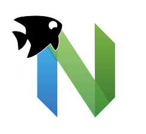

<div align="center">
 
<br/>

 <p>Neovim language support for <a href="https://spade-lang.org">Spade</a>.</p>
</div>

## 🚀 Showcase


## 📕 Contents

- [Features](#features)
- [Requirements](#requirements)
- [Install](#install)
- [Help](#help)

<a name="features"></a>

## ✨ Features

- Syntax highlighting (automatically checks for updates if you have internet)
- Language server support (e.g., code completion, go to definition, hover, error reporting)
- Jump to `swim.toml` with `:Spade openSwim` (<https://github.com/ethanuppal/spade.nvim/issues/2>)
- Autoformatting with [spadefmt](http://github.com/ethanuppal/spadefmt) (<https://github.com/ethanuppal/spade.nvim/issues/3>)
- Keybinds (<https://github.com/ethanuppal/spade.nvim/issues/7>)
- 💤 Lazy loading by default

<a name="requirements"></a>

## ⚡️ Requirements

Depending on what package manager you're using, you may not need to worry about these (see [Install](#install)).

- [nvim-treesitter](https://github.com/nvim-treesitter/nvim-treesitter)
- [query files](https://gitlab.com/spade-lang/spade-vim)

<a name="install"></a>

## 📦 Install

> [!NOTE]
> This section assumes a Unix-like operating system.

First, you'll want to grab the Spade LSP (you might need to [install
rust](https://www.rust-lang.org/tools/install)):

```sh
cargo install --locked --git https://gitlab.com/spade-lang/spade-language-server
```

**Recommended**: Alternatively, you can also build the LSP yourself with changes if it's not up-to-date with the
latest in Spade, as I have done:

```sh
cargo install --locked --git https://gitlab.com/ethanuppal/spade-language-server
```

Then, install the plugin with your preferred package manager.

### [lazy.nvim](https://github.com/folke/lazy.nvim)

```lua
{ "ethanuppal/spade.nvim" }
```

You can supply configuration with the optional `opts` field, as in

```lua
{
    "ethanuppal/spade.nvim",
    opts = {
        lsp_command = "spade-language-server",
    }
}
```

Note that [lazy.nvim](https://github.com/folke/lazy.nvim) will automatically call `require("spade").setup(opts)` for you lazily as well as install the required dependencies.
If you want to disable lazy loading, set `lazy = false` in the plugin spec as
well in `opts`.

### [Packer.nvim](https://github.com/wbthomason/packer.nvim)

Manually install the [query files](https://gitlab.com/spade-lang/spade-vim),
then add:

```lua
use {
    "ethanuppal/spade.nvim",
    config = function()
        require("spade").setup()
    end,
    requires = {{ "nvim-treesitter/nvim-treesitter" }}
}
```

<a name="help"></a>

## ❓ Help

### Why isn't the LSP activating? I checked with `top` (or similar) and don't see the LSP process

Make sure you have a [`swim.toml`](https://docs.spade-lang.org/swim_project_configuration/config__Config.html) somewhere up your tree -- the LSP will activate in that directory.
