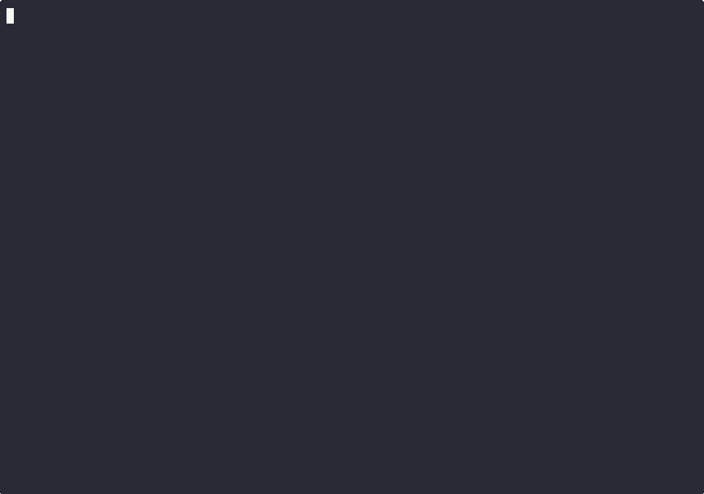

# spade.nvim



## Features

- Syntax highlighting
- Go-to-definition
- Code completion
- Hover

## Install

First, you'll want to grab the Spade LSP (you might need to [install
rust](https://www.rust-lang.org/tools/install)):

```sh
cargo install --locked --git https://gitlab.com/spade-lang/spade-language-server
```

### Recommended

Alternatively, you can also build the LSP yourself with changes if it's not up-to-date with the
latest in Spade, as I have done:

```sh
cargo install --locked --git https://gitlab.com/ethanuppal/spade-language-server
```

Install the plugin with your preferred package manager.
Here's how it would look like if you're using [lazy.nvim](https://github.com/folke/lazy.nvim):

```lua
{
    "ethanuppal/spade.nvim",
    dependencies = {
        "nvim-treesitter/nvim-treesitter",
        { url = "https://gitlab.com/spade-lang/spade-vim" },
        "neovim/nvim-lspconfig",
    },
    config = function()
        require("spade").setup({
            -- leave as {} for default options
            lsp_command = "spade-language-server"
        })
    end
}
```

Then, run `:TSInstall spade` one time.
You can later `:TSUninstall spade`.
